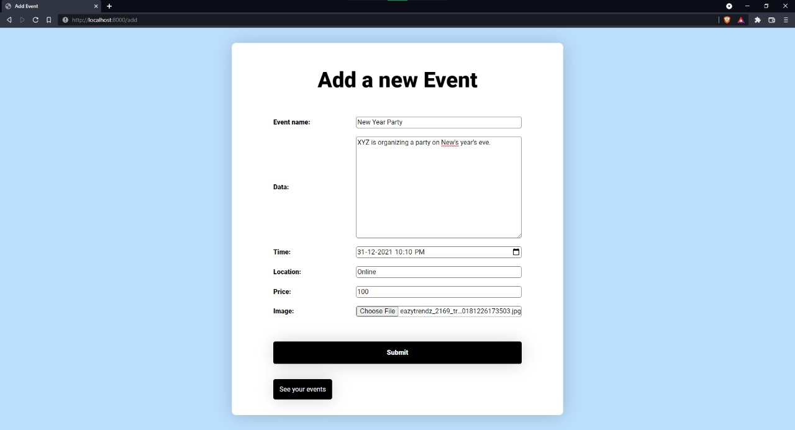
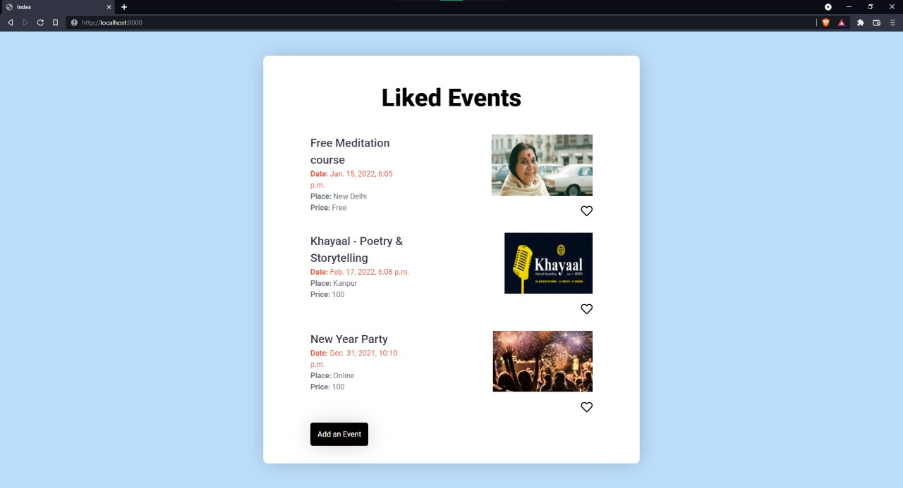

# Event Liking and Adding Django app

**This repo contains code for the assignment of 'Ignis Tech Solutions' by Anurag Jodha**

Screenshots:

1. Adding Event to the database (\add\ route)

2. Looking at all the events (main\index route)

3. Liking an event

*little typo: Liked Events should be My Events*

## Details of the code written

- There are two pages: index and add, index shows all the events stored in Database and 'add' page allows the user to add new events to the Database.
- Event model contains all the given paramaters in the assignment, but the index page only renders the things shown in the screenshot (eventbrite website)
- Liking and disliking facility is implemented using Ajax, when heart button is clicked 'is_liked' property of the event is toggled and ui is changed accordingly
- Database used is MySQL, with user 'djangouser', look at settings.py for more information
